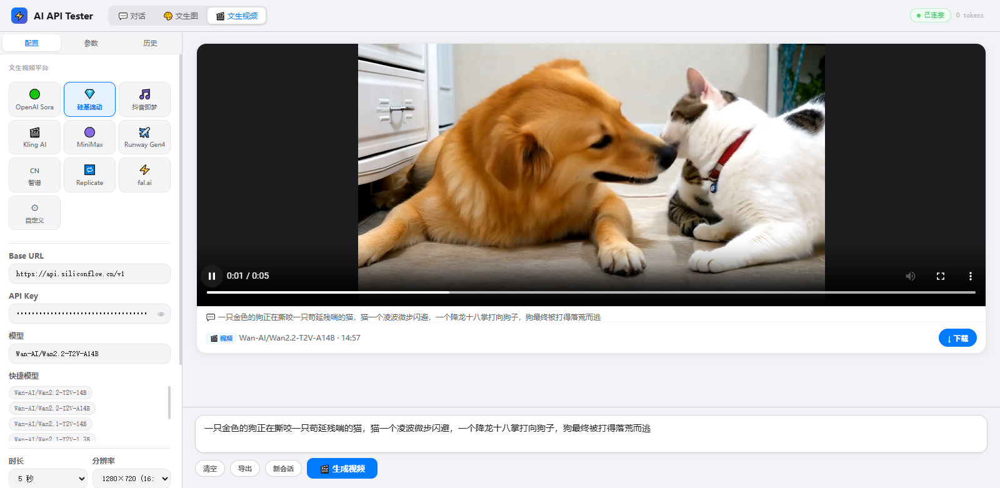

# Universal-AI-Tester

[English Version](./README_EN.md) | 中文说明

这是一个功能强大且极其轻量的 AI 接口测试工具，采用单 HTML 文件设计，无需任何后端环境，直接在浏览器中运行。它专为开发者调试各类大模型（LLM/多模态）而设计。

## ✨ 核心功能
- **全模式覆盖**：
  - 💬 **对话 (Chat)**：流式输出、打字机速度控制、Markdown 渲染、多模态视觉输入。
  - 🎨 **绘图 (Image)**：支持 OpenAI DALL-E 协议，多尺寸选择，图片生成历史管理。
  - 🎬 **视频 (Video)**：支持文生视频任务提交、状态轮询与视频预览。
- **高度灵活**：
  - 完美适配 OpenAI、DeepSeek、Claude、Gemini 等兼容标准协议的 API。
  - 自由调节 Temperature, Top P, Max Tokens 等参数。
- **实用特性**：
  - **实时计费**：内置 Token 统计及基于单价的费用计算。
  - **本地存储**：配置信息和历史记录加密存储于浏览器，保护隐私。
  - **导出功能**：支持将对话和生成记录导出为纯文本文件。

## 🚀 快速使用
1. 下载 `index.html`。
2. 双击在浏览器中打开。
3. 在左侧配置面板输入您的 `API Key` 和 `Base URL` 即可开始。

## 📸 界面预览

## 🛠 技术栈
- HTML5 / CSS3 (macOS 系统风格 UI)
- Vanilla JavaScript (Fetch API)
- Marked.js (Markdown 解析)

## 📄 开源协议
MIT License